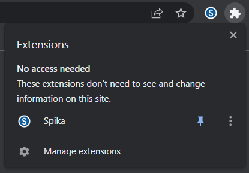

# Spika Web Wallet for Aptos Blockchain

## **Description**

Wallet was created during early stages of Aptos blockchain development and serves as an extension to [simple-cli-wallet](https://github.com/xorgal/simple-cli-wallet). It supports TestCoin transfer to other addresses and history of previous transactions. Account can be created with newly generated mnemonic phrase or by importing own mnemonic phrase in compliance with BIP39 standard. New account will start with 0 balance, however, it's possible to fund address by requesting TestCoin from Faucet. Mint function enables this. After address was successfully created account's mnemonic phrase and private key will be saved in browser's localStorage for next session. All sensitive data stored in browser are encrypted in AES-GCM mode using browser-passworder module. User's password serves as a key to unlock this data. Both mnemonic phrase and private key can be exported from localStorage at any time. "About" tab provides this information. Wallet doesn't save anything on it's own disk, all data saved in user's browser or in wallet's memory. Wallet's functional part is driven by Aptos SDK. Aptos Account is assembled in wallet's memory on each new browser's session based on mnemonic phrase provided either during generation of new account or during import of existing account.

## **Installation**
There are 3 ways to install web wallet:
- Download latest version from Chrome Web Store
- Download zipped package from GitHub
- Build from source

### **Chrome Web Store**
Navigate to [Chrome Web Store](https://chrome.google.com/webstore/detail/spika/fadkojdgchhfkdkklllhcphknohbmjmb) page and select **Add to Chrome**:


Web wallet will be installed and appear in the list of active extensions:



*NOTE: It might not be latest version of web wallet available in Chrome Web Store as publishing updates usually takes several days. See steps below for other options to update to latest version.*

### **Download zipped package from GitHub**
1. Navigate to **Releases** section and download latest zipped package
2. Unzip package's content
2. In Chrome browser open **Manage Extensions** tab and enable **Developer mode**
3. Select **Load Unpacked** and upload package. Web wallet will be install and appear in **Active Extensions** ready for use

### **Build from source**
Use this method to build extension from source and upload it to Chrome browser using steps described in [previous section](#download-zipped-package-from-github).

**Requirements:**
- Nodejs
- npm
- git

Clone this repository:
```shell
git clone https://github.com/xorgal/spika.git
cd spika
```
Install dependencies:
```
npm install
```
Build extension:
```
npm run build
```
Copy all files from `extension` directory to `build` directory and upload content of `build` directory to Chrome browser using steps described in [previous section](#download-zipped-package-from-github). 

*NOTE: As an option `build-ext.sh` script can be used to automate above steps*